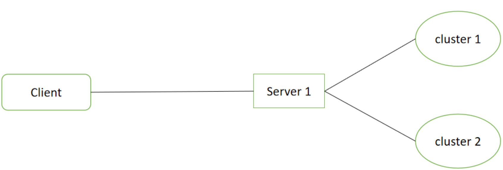
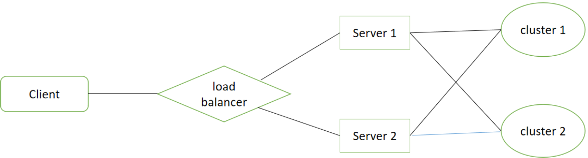

# Lab4: A Distributed Course Selection System

## 1. Overview

在 Lab 2 中，我们完成了一个简化的 HTTP/1.1 Web 服务器；

在 Lab 3 中，我们完成了一个简化的 分布式数据库课。

现在让我们尝试将两者组合并完善，构建一个高性能的分布式选课系统。

我们的目标：
 - 运用课程知识与过去的实验项目，构建一个分布式选课系统
 - 学习如何提高一个系统的健壮性和可扩展性，尽可能提升其性能

---

## 2. Background

你所需要的有关 Http Server 与 Distributed Database 的基础知识都在过去的实验中，如果你忘记了或者想要复习，可以重新查看 [Lab 2](./lab2.md) 和 [Lab 3](./lab3.md)。

### Load Balancer

! 待添加有关 Load Balancer 的介绍 !

---

## 3. Standardized Format

为了更好的进行测试与评阅，我们将对实验过程中的一些数据格式进行标准规定，请确保你实现的最终系统在这些对外接口上是我们的标准一致的。

### 3.1 Web Server

Web 服务器对外与 Clients 进行交互，负责解析来自 Clients 的请求，并根据需要向下查询数据库获取数据后响应给 Clients。

#### GET

对于 GET，至少应包含如下功能：

- 获取某项课程信息 `/api/search/course?id=[course id]`
- 获取所有课程信息 `/api/search/course?all`
- 获取某个学生的所选课程 `/api/search/student?id=[student id]`

> 除了特定的 `api` 之外，Web 服务器仍需要支持静态文件访问等基本功能（如支持显示 html 页面，非法 path 返回 404 页面等），在此略去介绍，具体信息可参考 Lab 2。

> 我们对 `api` 的设计进行了非常多的简化，现实中将会远比它们复杂，你可以使用要求以外的 path 扩展你的系统。 

##### /api/search/course

该 api 主要用于查询课程信息，相关的参数使用 `query string` 携带。

当需要查询某个课程时，通过 `course id` 代表课程；

> 课程编号仅由 `[a-zA-Z0-9]` 组成，不含有特殊字符。

查询后给出的数据至少需要包含课程的 编号，名称，容量和已选人数，这些数据包裹在 JSON 格式对象中，形式如下：

| query string | status code | response content type | response body | 
| --- | --- | --- | --- |
| id=[course id] | 200 | application/json | {"status":"ok","data":{"id":`course id`,"name": `course name`,"capacity":`capacity`,"selected":`selected`} |

特别的，如果需要查询全部课程，`query string` 中可选择携带 `all`。

与查询单个课程类似，但其 `data` 字段的值从单个课程信息变为了包含所有课程信息的数组。

| query string | status code | response content type | response body | 
| --- | --- | --- | --- |
| all | 200 | application/json | {"status":"ok", "data":[{"id":`course id`,"name": `course name`,"capacity":`capacity`,"selected":`selected`}, ...] |

对于 query string 格式或数据非法，无法查询到相关信息 等错误情况，返回包含错误信息的 JSON 对象即可。

| case | status code | response content type | response body |
| --- | --- | --- | --- |
| valid or can't get result | 403 | application/json | {"status":"error", "message":`error message`} |

##### /api/search/student

该 api 主要用于查询学生所选课程信息，相关的参数使用 `query string` 携带。

当需要查询某个学生相关信息时，通过 `student id` 代表课程；

> 学生学号编号仅由 `[0-9]` 组成，不含有特殊字符。

查询后给出的数据至少需要包含学生的 学号，姓名，所选的课程编号，这些数据包裹在 JSON 格式对象中，形式如下：

| query string | status code | response content type | response body | 
| --- | --- | --- | --- |
| id=[student id] | 200 | application/json | {"status":"ok","data":{"id":`student id`,"name": `student name`,"courses":[{"id"=`course id a`, "name": `course name a`},...} |

> 如果学生未选课程， `data.course = []` 即可。

对于 query string 格式或数据非法，无法查询到相关信息 等错误情况，返回包含错误信息的 JSON 对象即可。

| case | status code | response content type | response body |
| --- | --- | --- | --- |
| valid or can't get result | 403 | application/json | {"status":"error", "message":`error message`} |

#### POST

对于 POST，至少应包含如下功能：

- 学生进行选课 `/api/choose`
- 学生进行退课 `/api/drop`

##### /api/choose

该 api 主要用于进行选课操作，相关的参数使用 `http request body` 携带。

当需要进行选课操作时，`payload` 应至少包含 学生学号，课程编号；

操作后给出的数据至少需要包含操作的结果，这些数据包裹在 JSON 格式对象中，形式如下：

| response content type | payload | status code | response content type | response body | 
| --- | --- | --- | --- | --- | 
| application/json | {"student_id":`student id`,"course_id":`course id`} | 200 | application/json | {"status":"ok"} |

对于 payload 格式或数据非法，无法查询到相关信息，课程已满 等错误情况，返回包含错误信息的 JSON 对象即可。

| case | status code | response content type | response body |
| --- | --- | --- | --- | --- | 
| valid or can't get result | 403 | application/json | {"status":"error", "message":`error message`} |

##### /api/drop

该 api 主要用于进行退课操作，相关的参数使用 `http request body` 携带。

当需要进行选课操作时，`payload` 应至少包含 学生学号，课程编号；

操作后给出的数据至少需要包含操作的结果，这些数据包裹在 JSON 格式对象中，形式如下：

| response content type | payload | status code | response content type | response body | 
| --- | --- | --- | --- | --- | 
| application/json | {"student_id":`student id`,"course_id":`course id`} | 200 | application/json | {"status":"ok"} |

对于 payload 格式或数据非法，无法查询到相关信息，课程已满 等错误情况，返回包含错误信息的 JSON 对象即可。

| case | status code | response content type | response body |
| --- | --- | --- | --- | --- | 
| valid or can't get result | 403 | application/json | {"status":"error", "message":`error message`} |

## 3.2 Database

### Tables

数据库的基础格式是关系型数据库，你也可以根据需要增添修改数据的类型，也可以选择设计新类型的数据库，但必须保证通过数据库可以正常完成需要的功能。

**用于标准化测试的数据，将在仓库中提供。**

#### Course

| id(key) | name | capacity | selected |
| --- | --- | --- | --- |
| string | string | int | int |
| "CS06142" | "云计算技术" | 120 | 120 |

#### Student

| id(key) | name |
| --- | --- |
| string | string |
| "211926010111" | "张三" |

#### Course Selection

| Course id(key-1) | Student id(key-2) |
| --- | --- |
| string | string |
| "CS06142" | "211926010111" |

### Commands

正常情况下，用户访问数据仅通过前端的 HTTP Web 服务器，而数据查询由 Web 服务器与数据库集群进行交互。

以下给出的数据库命令仅供参考，你可以选择自己实现一个满足相同基本功能的命令集。

#### Check Courses Capacity

发送 `GET Course [course id]\n`, e.g., `GET Course CS06142\n`；

返回 `[course id] [course name] [course capacity] [selected number]\n`, e.g., `CS06142 云计算技术 120 120\n`

特别的，可以一次查询所有的课程最大容量信息:

发送 `GET Course Capacity all\n`, e.g., `GET Course Capacity all\n`；

返回 **多行** `[course id] [course name] [course capacity] [selected number]\n`, e.g., `CS04008 计算机网络 90 80\nCS06142 云计算技术 120 120\n`。

#### Check Student Selected Courses

发送 `GET Student Courses [student id]\n`, e.g., `GET Student Courses 211926010111\n`；

返回 **多行** `[course id] [course name]\n`, e.g., `CS04008 计算机网络\nCS06142 云计算技术\n`。

#### Choose a Course

发送 `ADD Student Course [student id] [course id]\n`, e.g., `ADD Student Course 211926010111 CS06142\n`；

如果成功，返回 `+OK`; 如果失败，返回 `-ERROR`。

#### Drop a Course

发送 `DEL Student Course [student id] [course id]\n`, e.g., `DEL Student Course 211926010111 CS06142\n`；

如果成功，返回 `+OK`; 如果失败，返回 `-ERROR`。

## 4. Your Tasks

### Basic Version

对于 basic 版本，你只需要运行一个 Web 服务器，与其相连的是多个数据库集群。

对于 Web 服务器，我们要求：支持高并发，可以同时响应多个客户端发送的请求。

对于 数据库集群，我们要求：集群数量不小于2，单个集群之间的通信可以使用 2PC 或 RAFT 协议实现。

> 当存储器集群数量增多时，你需要对存储的数据进行分块，如 Course 中的部分数据可以存储在 Cluster 1 中，另一部分相关的数据可以存储在 Cluster 2 中。

### Advanced Version

对比 basic 版本，你需要在 basic 版本的基础上，同时运行多个 相同功能的 Web 服务器，并实现一个自己的负载均衡器，它能够对来自客户端的请求进行分流，向合适 Web 服务器转发客户端请求。

## 5. Test

默认情况下，我们将在 Linux Ubuntu 18.04 x64 服务器进行测试。

我们预期的测试项目有：

- 正确性测试，检查你的系统能否在低并发下和简单异常（如某数据库网络故障）下正常完成功能；
- 高性能压力测试，检查你的系统能否在频繁动态发生异常的情况下正常完成功能，并检测其对于客户端提供服务的能力。

## 6. Lab submission

将你的代码提交到 `/Lab4/` 文件夹，并编写 `Makefile` 确保可以直接使用 `make` 命令编译所有需要的可执行文件。

考虑到 `Lab 4` 实现完整系统较为复杂，请在提交代码的同时，编写一份 `intro.md` ，并添加一些说明，如：如何编译运行的程序，是否运用了其他依赖库，如何安装等。

## 7. Grading standards

完成所有 Basic 版本的要求，你将获得 8 分；

完成所有 Advanced 版本的要求，你将获得 10 分。

如果你有部分功能没有实现，将根据你的完成情况进行细化打分。
